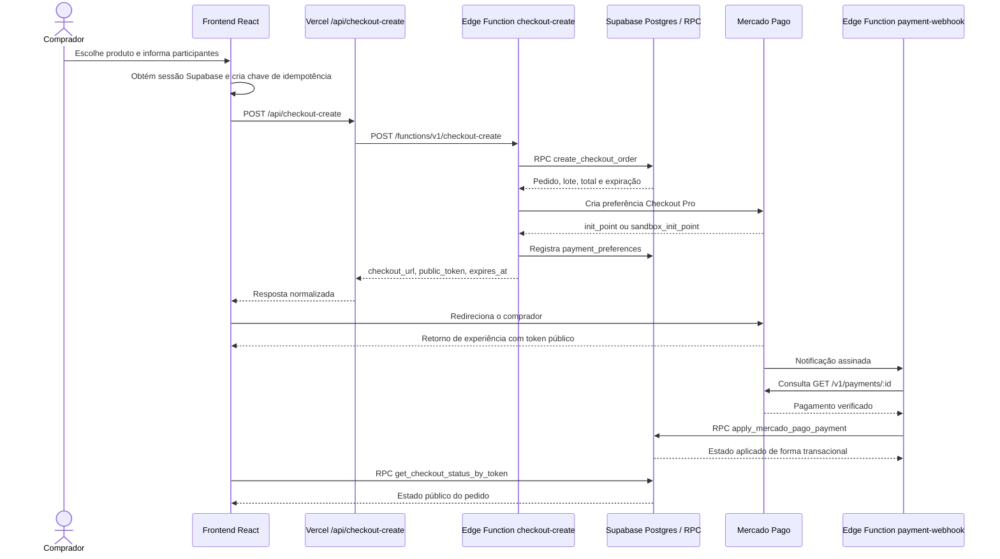

# Checkout e pagamentos

## Objetivo

Este documento descreve o fluxo vigente de criação de pedidos, geração de preferência no Mercado Pago, confirmação financeira e consulta do resultado pelo comprador.

Ele explica responsabilidades e limites. Os contratos exatos de tabelas, RPCs, policies e códigos de erro continuam subordinados ao estado final das migrations, ao código e aos testes.

## Princípios

1. O navegador não calcula nem confirma o valor financeiro definitivo.
2. O checkout exige uma sessão válida do Supabase.
3. O banco seleciona o lote vigente, valida a composição e calcula o preço.
4. O retorno do navegador vindo do Mercado Pago é apenas um sinal de interface.
5. A confirmação financeira ocorre pelo webhook, após consulta do pagamento na API do Mercado Pago.
6. Operações críticas usam service role apenas em componentes server-side.
7. Criação de pedido, preferência e aplicação de pagamento devem ser idempotentes.

## Produtos comerciais vigentes

O catálogo público atual é composto por três produtos:

| Código | Nome funcional | Composição esperada |
|---|---|---|
| `simple` | Individual | Um ex-aluno pré-cadastrado e vinculado à conta. |
| `family_full` | Família | Um ex-aluno, um cônjuge e pelo menos um filho. |
| `external_guest` | Convidado | Um participante adulto que não é ex-aluno. |

O backend ainda contém referências de compatibilidade a modelos anteriores, como `family_single_parent` e extras. Essas referências não transformam os modelos antigos em produtos vigentes. A autoridade comercial é a combinação entre migrations atuais, catálogo retornado pelo banco e validações da RPC `create_checkout_order`.

## Visão do fluxo

## 1. Preparação no frontend

A função `createSecureCheckout` em `src/lib/checkout.ts`:

- exige sessão autenticada;
- cria ou recebe uma chave de idempotência;
- envia comprador, produto e participantes;
- chama `POST /api/checkout-create`;
- envia `Authorization`, `apikey` e `idempotency-key`;
- normaliza respostas compatíveis com `checkout_url`, `init_point` ou `sandbox_init_point`;
- devolve `checkout_url`, `public_token` e `expires_at`.

O frontend pode apresentar uma estimativa e validar campos para experiência do usuário, mas não é fonte de verdade para preço, lote, elegibilidade ou disponibilidade.

## 2. Proxy da Vercel

`api/checkout-create.ts` é uma Vercel Function de borda entre o navegador e a Edge Function do Supabase.

Responsabilidades:

- aceitar somente `POST`;
- exigir o cabeçalho de autenticação;
- resolver a URL e a chave pública do Supabase;
- encaminhar corpo, sessão e chave de idempotência;
- preservar status de erro do serviço upstream;
- impedir cache da resposta;
- normalizar o contrato de retorno.

O proxy não usa service role e não executa cálculo de preço.

## 3. Edge Function `checkout-create`

A função `supabase/functions/checkout-create/index.ts`:

1. valida método e origem;
2. autentica o usuário com a chave pública do Supabase;
3. valida `MERCADO_PAGO_ENV`;
4. valida o payload e o limite de até seis participantes;
5. procura uma preferência ativa equivalente para a mesma chave de idempotência;
6. chama `create_checkout_order` com service role;
7. recebe do banco o pedido, lote, valor total e expiração;
8. cria uma preferência no Mercado Pago;
9. seleciona `sandbox_init_point` em teste e `init_point` em produção;
10. registra a preferência em `payment_preferences`;
11. associa os identificadores financeiros ao pedido;
12. devolve a URL de checkout e o token público.

### Autoridade da RPC

A RPC `create_checkout_order` é responsável pelas regras transacionais, entre elas:

- produto disponível;
- lote ativo;
- vínculo do ex-aluno;
- composição do pacote;
- idade e dados obrigatórios;
- limite de participantes;
- cálculo do preço em centavos;
- criação ou reutilização idempotente;
- reserva e expiração.

Uma regra implementada apenas no React não é suficiente para proteger o fluxo.

## 4. Preferência do Mercado Pago

A preferência é criada server-side com:

- moeda `BRL`;
- total calculado no banco;
- `external_reference` igual ao UUID do pedido;
- token público e dados resumidos em `metadata`;
- retorno para sucesso, falha e pendência;
- `notification_url` apontando para `payment-webhook`;
- expiração alinhada à reserva do pedido;
- boleto excluído;
- até três parcelas.

A chave de idempotência enviada ao Mercado Pago deriva do pedido e do ambiente.

## 5. Retorno do navegador

O Mercado Pago retorna o usuário ao site com parâmetros de experiência, incluindo o token público do pedido.

Esse retorno:

- pode ocorrer antes do webhook;
- pode ser repetido ou manipulado;
- não deve alterar o status financeiro;
- não deve emitir ingresso;
- não deve ser usado como prova de pagamento.

A interface consulta `get_checkout_status_by_token` para obter um estado público seguro.

## 6. Webhook financeiro

`supabase/functions/payment-webhook/index.ts` é a entrada autoritativa para notificações do Mercado Pago.

A função:

1. aceita somente `POST` e `OPTIONS`;
2. exige `MERCADO_PAGO_WEBHOOK_SECRET`;
3. interpreta `x-signature` e `x-request-id`;
4. valida HMAC SHA-256 usando o manifesto do Mercado Pago;
5. rejeita assinaturas com timestamp fora da janela de 15 minutos;
6. registra o evento em `payment_events`;
7. trata eventos duplicados por chave única;
8. ignora notificações que não sejam de pagamento;
9. consulta o pagamento diretamente em `GET /v1/payments/:id`;
10. valida identificador, referência externa e valor recebido;
11. chama `apply_mercado_pago_payment`;
12. marca o evento como processado ou falho.

Falhas temporárias retornam status que permite nova tentativa do provedor.

## 7. Aplicação do pagamento

A RPC `apply_mercado_pago_payment` é a autoridade para converter a resposta verificada do provedor em estado interno.

Ela deve permanecer responsável por validar e aplicar, de modo transacional e idempotente:

- correspondência entre pedido, preferência e pagamento;
- valor e moeda;
- progressão permitida de status;
- aprovação, rejeição, cancelamento, estorno ou chargeback;
- emissão ou invalidação de ingressos;
- liberação ou consumo de reserva;
- criação de trabalhos de notificação;
- rastreabilidade administrativa.

A implementação exata é definida pelas migrations vigentes e pelos testes SQL.

## 8. Notificações

Notificações transacionais não devem bloquear o processamento crítico do webhook.

A arquitetura utiliza `notification_jobs` e a Edge Function `notification-worker` para processamento desacoplado, tentativas e registro de falhas. O envio depende dos provedores e secrets configurados no ambiente.

## 9. Reembolsos

Reembolsos são processados por fluxo separado, com solicitação, revisão administrativa e Edge Function `refund-processor`.

A política funcional, elegibilidade, restauração de inventário e invalidação de ingressos devem ser aplicadas no banco. Não se deve alterar manualmente somente o status visual do pedido.

## Variáveis de ambiente

### Frontend

| Variável | Exposição | Uso |
|---|---|---|
| `VITE_SUPABASE_URL` | Pública | URL do projeto Supabase. |
| `VITE_SUPABASE_ANON_KEY` | Pública | Chave pública para autenticação e RLS. |
| `VITE_DEV_MODE` | Pública | Comportamento de desenvolvimento quando aplicável. |

### Vercel Function

| Variável | Uso |
|---|---|
| `SUPABASE_URL` | Destino preferencial da Edge Function. |
| `SUPABASE_ANON_KEY` | Chave pública encaminhada ao Supabase. |

As variantes `VITE_*` são aceitas como fallback pelo proxy atual.

### Supabase Edge Functions

| Variável | Uso |
|---|---|
| `SUPABASE_URL` | URL interna do projeto. |
| `SUPABASE_ANON_KEY` | Validação da sessão do comprador. |
| `SUPABASE_SERVICE_ROLE_KEY` | Operações server-side que ignoram RLS. |
| `SITE_URL` | Origens e URLs de retorno. |
| `CHECKOUT_ALLOWED_ORIGINS` | Origens adicionais permitidas. |
| `SUPABASE_FUNCTIONS_URL` ou `FUNCTIONS_PUBLIC_URL` | Base pública da URL do webhook. |
| `MERCADO_PAGO_ENV` | `test` ou `production`. |
| `MERCADO_PAGO_ACCESS_TOKEN` | API do Mercado Pago. |
| `MERCADO_PAGO_WEBHOOK_SECRET` | Validação HMAC do webhook. |

Variáveis de notificações e reembolsos serão consolidadas no inventário gerado de ambiente.

## Segurança

- Nunca usar `SUPABASE_SERVICE_ROLE_KEY` em código Vite ou variável `VITE_*`.
- Nunca confiar em preço enviado pelo navegador.
- Nunca emitir ingressos a partir do retorno de `back_urls`.
- Nunca aceitar webhook sem assinatura válida e consulta ao provedor.
- Não registrar tokens, chaves, payloads sensíveis completos ou dados pessoais desnecessários em logs.
- Manter `payment_events` para auditoria e diagnóstico.
- Preservar RLS para consultas do comprador; service role deve permanecer restrita às funções server-side.

## Compatibilidade e dívida técnica conhecida

- O proxy Vercel possui uma URL fallback fixa do projeto Supabase. O inventário futuro de ambientes deve remover ou justificar essa dependência.
- O frontend e o proxy aceitam nomes de campos legados de resposta para tolerar versões anteriores.
- A Edge Function ainda reconhece categorias e estruturas antigas no tipo de entrada, embora a RPC vigente restrinja o modelo comercial.
- `supabase/functions/server/index.ts` e rotas `make-server-62fab262` representam a arquitetura anterior e não são o caminho canônico do checkout atual.
- Os tipos Supabase mantidos manualmente precisam ser substituídos por geração a partir do banco reproduzido.

## Validação mínima antes de produção

1. Reaplicar todas as migrations em uma stack local limpa.
2. Executar os testes SQL de checkout, webhook, reporting, reembolso e check-in.
3. Executar o build da aplicação.
4. Validar um pagamento de teste do início ao webhook.
5. Confirmar idempotência repetindo criação e notificação.
6. Confirmar que o retorno do navegador não aprova o pedido sozinho.
7. Validar consulta por token público e por comprador autenticado.
8. Confirmar emissão de ingressos e enfileiramento de notificações.
9. Confirmar tratamento de rejeição, expiração e reembolso.
10. Preservar evidências da validação sem registrar credenciais ou dados pessoais desnecessários.

## Documentos relacionados

- [`../00-visao-geral/fontes-de-verdade.md`](../00-visao-geral/fontes-de-verdade.md)
- [`../00-visao-geral/arquitetura.md`](../00-visao-geral/arquitetura.md)
- [`../50-governanca/politica-de-documentacao.md`](../50-governanca/politica-de-documentacao.md)
- `supabase/tests/` para contratos SQL executáveis
- `docs/PRODUCTION_QA.md` como checklist legado ainda em reconciliação
